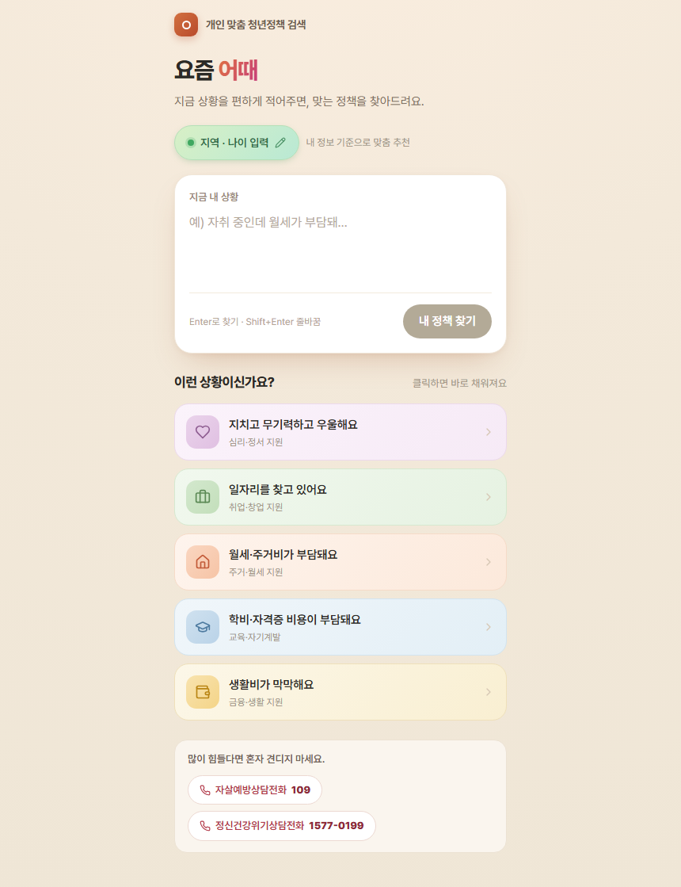
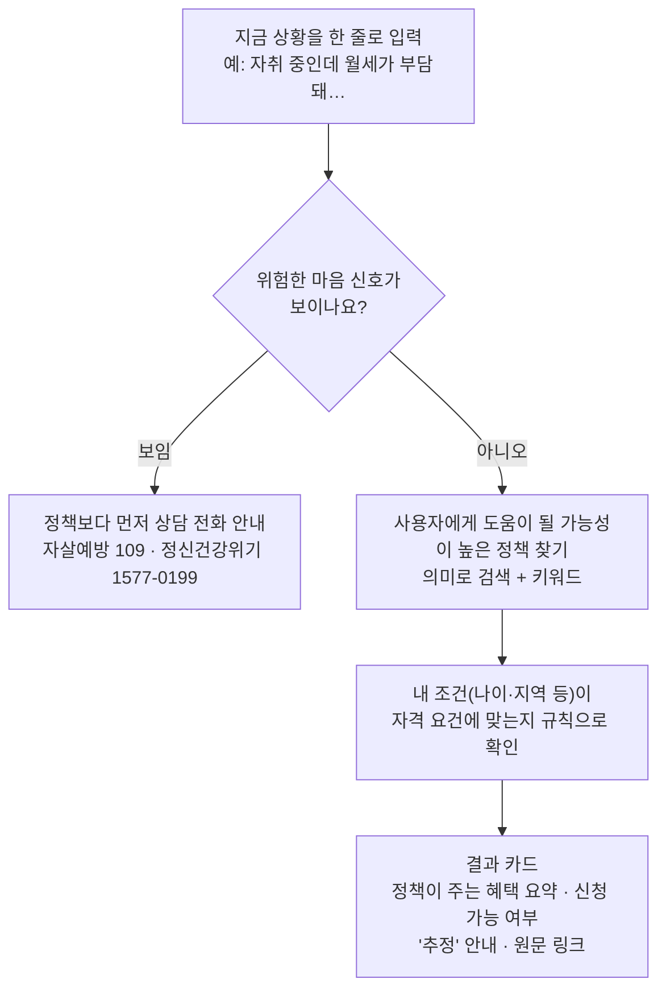

# 요즘 어때

**개인 맞춤 청년정책 검색**

지금 상황을 편하게 한 줄로 적으면 — 예: _"자취 중인데 월세가 부담돼…"_ — 사용자에게 도움이 될 가능성이 높은 청년정책 중 **지금 신청할 수 있는 정책**을 안내하고, **내 조건이 자격 요건에 해당하는지**까지 살펴봐 주는 서비스입니다. 정확한 정책 이름이나 검색어를 몰라도 됩니다.

[](https://github.com/slowdive14/cheongnyeon/actions/workflows/build-gate.yml)
[](LICENSE)

🔗 **라이브 → [eottae.vercel.app](https://eottae.vercel.app)**

<p align="center">
  
</p>

---

## ✨ 핵심 기능

- **말로 검색** — 키워드가 딱 맞지 않아도, 자기 말로 상황을 적으면 그 상황에 적합한 정책을 찾아줍니다. 예를 들어 _"공허하고 무기력해요"_ 라고만 적어도 마음건강 관련 정책을 찾아줍니다.
- **위험한 마음 신호가 먼저** — 마음이 위험한 신호가 보이면, 정책보다 먼저 상담 전화(자살예방상담 109, 정신건강위기상담 1577-0199)를 크게 안내합니다. 이 감지는 인터넷이 끊기거나 서버에 문제가 있어도 **항상 작동**합니다.
- **지금 신청 가능한 것만** — 이미 마감된 공고는 자동으로 걸러내고, 지금 신청할 수 있는 정책만 보여줍니다.
- **자격 요건 살펴보기** — 나이·지역 같은 내 조건이 정책의 자격 요건에 부합하는지 짚어줍니다. 다만 '된다/안 된다'로 단정하지 않고, 최종 확인은 시행기관의 공고를 확인하라는 안내를 늘 함께 답니다.
- **없는 내용을 지어내지 않음** — 자격 판정은 AI가 아니라 정해진 규칙(조건 계산)으로 하고, 정책 내용은 원문 그대로 보여줍니다. AI가 원문에 없는 말을 만들어내지 못하게 막았습니다.

---

## 🧭 어떻게 동작하나



- **찾기** — 사용자의 문장과 각 정책을 '의미 좌표(숫자 벡터)'로 바꿔, 사용자 질의와 의미상 가까운 정책을 찾습니다. 같은 상황도 사람마다 다르게 말하기 때문에, 단어가 겹치지 않아도 의미로 찾습니다. 정확히 겹치는 단어를 찾는 키워드 검색도 함께 써서 놓치는 걸 줄입니다.
- **자격 확인** — 나이·소득·지역 같은 조건을 정해진 규칙으로 하나씩 따져, 자격 요건에 해당하는지 살펴봅니다. AI의 추측이 아니라 정해진 계산이라, 결과가 늘 일정하고 근거를 되짚어 확인할 수 있습니다.
- **보여주기** — 결과 카드에 혜택(이 정책으로 어떤 혜택을 받는지) 요약, 지금 신청할 수 있는지 여부, 내 조건 중 맞는 부분과 확인이 필요한 부분, 그리고 '추정' 안내와 원문 링크를 함께 담습니다.

> 사람마다 같은 상황을 다르게 말합니다. 그래서 말에 담긴 핵심 의미로 찾습니다. 표현이 달라도 맞는 정책을 놓치지 않고, 자격은 정해진 규칙으로 따져 결과를 믿을 수 있게 했습니다.

---

## 🛡️ 안전하고 믿을 수 있게 — 지킨 원칙

이 서비스가 공들인 부분입니다.

- **위험한 순간이 먼저입니다.** 위험한 마음 신호가 보이면 정책 대신 상담 연결 가능한 전화번호를 먼저 보여주고, 마음이 좀 진정되면 언제든 다시 검색으로 돌아올 수 있게 안내합니다. 
- **자격을 함부로 단정하지 않습니다.** '된다/안 된다' 대신 '확인이 필요하다'고 안내합니다. 원문 링크로 들어가 시행기관의 공고를 살펴야 함을 안내합니다.
- **없는 정보를 지어내지 않습니다.** 정책 내용은 원문 그대로 전합니다.
- **어디서 온 정보인지 밝힙니다.** 모든 결과에 '추정'이라는 안내, 원문으로 가는 링크, 데이터를 언제 받아왔는지를 함께 보여줍니다.

안전 관련 규칙을 포함한 핵심 기능은 약 920개의 자동 테스트로 개발 중에 확인합니다. 또 코드가 바뀔 때마다 GitHub Actions가 자동으로 빌드를 검사해, 빌드가 깨진 채로 배포되는 일을 막습니다.

---

## 🧱 기술 스택

| 영역 | 사용 기술 |
|------|-----------|
| 화면 | React · TypeScript · Vite · Tailwind CSS |
| 검색·데이터 | Supabase (PostgreSQL + pgvector) · 서버용 Edge Function · 온통청년 Open API |
| AI | 구글 Gemini — 문장의 의미를 숫자 벡터로 바꾸는 데 사용(임베딩) |
| 품질·운영 | Vitest 자동 테스트 · GitHub Actions(정기 수집 + 빌드 검사) · Vercel 배포 |

---

## 🚀 로컬에서 실행하기

```bash
git clone https://github.com/slowdive14/cheongnyeon.git
cd cheongnyeon
npm install
npm run dev          # http://localhost:5173
```

**API 키는 없어도 됩니다.** 키 없이 실행하면 미리 담아 둔 예시 정책과 키워드 검색으로 앱이 동작합니다. `.env.example`을 `.env`로 복사해 키를 채우면 실시간 데이터와 AI 의미 검색이 켜집니다.

```bash
npm test             # 자동 테스트 (vitest)
npm run build        # 프로덕션 빌드 (tsc -b && vite build)
npm run lint         # 코드 점검 (eslint)
npm run ingest       # 온통청년 데이터 수집 (ONTONG_API_KEY 필요)
```

---

## 📁 프로젝트 구조

```
src/
├─ domain/      # 순수 함수: 자격 규칙 · 위험 신호 감지 · 정책 정규화 · 상담 자원
├─ retrieval/   # 검색: 의미(임베딩) + 키워드
├─ data/        # 온통청년/서울 데이터 수집 · 정리 · 캐시
├─ llm/         # 구글 Gemini 연동(분류·임베딩) · API 키 저장소
└─ ui/          # React 화면 · 안전 안내 배너
supabase/       # PostgreSQL + pgvector 스키마(setup.sql) · 검색 Edge Function
scripts/        # 데이터 수집 진입점(정기 실행)
test/           # 자동 테스트 (vitest + Testing Library)
docs/           # 설계·계획·오픈소스 라이선스 문서
```

---

## 📊 데이터와 라이선스

- 정책 데이터는 **온통청년**([youthcenter.go.kr](https://www.youthcenter.go.kr))에서 정기적으로 받아옵니다. 전국 청년정책 약 2,650개를 모아, 이미 마감된 공고는 자동으로 걸러내고 **지금 신청 가능한 약 780개** 안에서 찾아줍니다.
- **서울시 자체 정책**은 서울시의 이용 허가가 필요해 지금은 빼두었습니다. 허가를 받으면 다시 넣을 수 있습니다.
- **코드**는 [MIT 라이선스](LICENSE)로 자유롭게 쓰실 수 있습니다. 정책 데이터는 각 제공처의 공공데이터 이용약관을 따릅니다.
- 이 프로젝트가 사용하는 공개 소프트웨어 부품(373개)은 모두 자유롭게 쓸 수 있는 라이선스입니다 — 자세한 목록은 [docs/OPEN_SOURCE_LICENSES.md](docs/OPEN_SOURCE_LICENSES.md).

---

## 🙌 만든 사람

**팀 마음다음 · 오송인**

상담 현장에서 청년에게 맞는 정책을 찾아 알려주던 경험에서 출발했습니다. 굳이 상담자를 거치지 않아도, 누구나 자기에게 맞는 정책을 스스로 찾을 수 있으면 좋겠다는 마음으로 만들었습니다.
