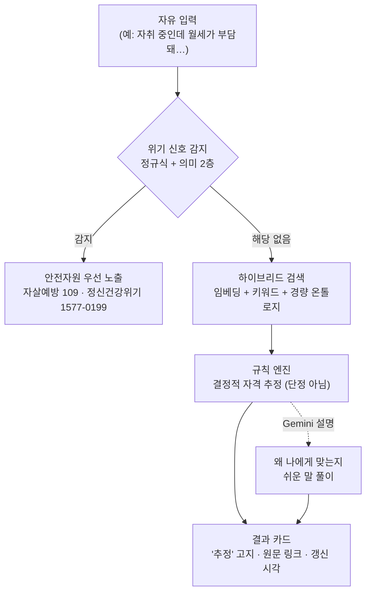

# 요즘 어때

**맞춤형 청년정책 진단 · 욕구 발견 깔때기**

자기 상황을 한 줄로 적으면 — 예: _"자취 중인데 월세가 부담돼…"_ — 전국 청년정책 중 **지금 신청할 수 있는 것**을 찾아 **자격까지 추정**해 주는 진단형 도구입니다. 검색어도, 정책 이름도 몰라도 됩니다.

[](https://github.com/slowdive14/cheongnyeon/actions/workflows/build-gate.yml)
[](LICENSE)

🔗 **라이브 데모 → [eottae.vercel.app](https://eottae.vercel.app)**

> 소프트웨어 경진대회 출품 MVP. 첫 수직 슬라이스로 **마음건강** 영역을 데이터→검색→자격→설명까지 end-to-end로 구현했습니다.

---

## ✨ 핵심 특징

- **검색이 아니라 진단** — 키워드가 아니라 상황·감정을 말하면, 갈래를 좁혀 지금 행동할 수 있는 정책으로 안내합니다.
- **위기 신호 우선** — 마음건강 영역 특성상 위기 가능성이 상존합니다. 위기 신호가 감지되면 정책보다 **안전자원(자살예방상담 109, 정신건강위기상담 1577-0199)** 을 최우선 노출합니다.
- **자격은 '추정', 단정하지 않음** — 결정적 규칙 엔진으로 4개 축(나이·소득·지역·상태)을 보수적으로 판정하고, 모든 카드에 _"추정 · 최종 자격은 시행기관 공고 기준"_ 고지 + **원문 링크** + **데이터 갱신 시각**을 답니다.
- **LLM은 거들 뿐, 판정하지 않음** — Gemini는 해석·질문·설명·리랭킹·파싱만 담당하고, 후보 선택과 자격 판정은 검색·규칙이 맡습니다. 자격 **날조를 구조적으로 차단**하기 위한 분리입니다.
- **키 없이도 돈다** — API 키가 없거나 외부 장애가 나도 fixture·키워드 폴백으로 검색이 끊기지 않습니다(graceful degradation). 위기 감지 1층(정규식)은 네트워크·키와 무관하게 항상 작동합니다.

---

## 🧭 어떻게 동작하나



**관련성**은 하이브리드 검색(의미 임베딩 + 키워드 + 경량 온톨로지)이, **자격**은 결정적 규칙 테이블이 담당합니다 — 둘을 엄격히 분리해, "같은 욕구를 백 가지로 말하는" 패러프레이즈는 임베딩이 잡되 자격 판정은 감사 가능한 규칙으로 유지합니다.

---

## 🛡️ 안전·신뢰 설계 원칙

이 프로젝트가 가장 공들인 부분입니다. 위반 시 사용자에게 실제 해가 되는 불변식들:

| 원칙 | 구현 |
|------|------|
| 위기 청년 최우선 | 위기 감지 시 정책 깔때기 억제, 안전자원 단독 노출. 타이핑 중엔 인라인 안내(말 끊지 않음), 제출 시 전체 전환 |
| 자격 날조 금지 | 자격 판정은 결정적 규칙만. LLM은 판정 경로에 개입하지 않음 |
| 근거 없는 표기 금지 | 미검증 전화번호·기관명은 노출하지 않음. 막힌(blocked) 정책은 청년 화면에서 숨김 |
| 투명성 | 모든 결과에 '추정' 고지 · 원문 링크 · 데이터 신선도 표시 |
| 가용성 | 위기 감지 1층(정규식)은 키·네트워크 없이 상시 동작 |

CI에 **프로덕션 빌드 게이트**(`tsc -b && vite build`)를 걸어, 타입 오류로 인한 조용한 배포 실패를 push마다 차단합니다.

---

## 🧱 기술 스택

| 영역 | 사용 기술 |
|------|-----------|
| 프론트엔드 | React 19 · TypeScript 5.9 · Vite 7 · Tailwind CSS 3.4 |
| 검색·데이터 | Supabase (PostgreSQL + pgvector) · Deno Edge Function · 온통청년 Open API |
| LLM | Google Gemini (`@google/genai`) — 해석·설명·파싱·임베딩 |
| 테스트 | Vitest · Testing Library (TDD) |
| 운영 | GitHub Actions (일일 인제스트 cron + 빌드 게이트) · Vercel 배포 |

---

## 🚀 로컬에서 실행하기

```bash
git clone https://github.com/slowdive14/cheongnyeon.git
cd cheongnyeon
npm install
npm run dev          # http://localhost:5173
```

**환경 변수는 선택 사항입니다.** `.env.example`을 `.env`로 복사한 뒤 키를 채우면 실데이터·LLM이 켜지고, **키가 없어도 fixture·키워드 폴백으로 앱과 테스트가 완전히 동작**합니다.

```bash
npm test             # 단위·통합 테스트 (vitest)
npm run build        # 프로덕션 빌드 (tsc -b && vite build)
npm run lint         # eslint
npm run ingest       # 온통청년 데이터 적재 (ONTONG_API_KEY 필요)
```

---

## 📁 프로젝트 구조

```
src/
├─ domain/      # 순수 함수: 자격 규칙 엔진(eligibility)·위기 감지(crisis)·정규화·안전자원
├─ retrieval/   # 하이브리드 검색: 임베딩 · 키워드 · config
├─ data/        # 온통청년/서울 클라이언트 · 인제스트 · 캐시 · 청킹
├─ llm/         # Gemini 분류·설명·위기 보강 · API 키 저장소
└─ ui/          # React 깔때기 UI(funnel) · 안전 배너
supabase/       # PostgreSQL + pgvector 스키마(setup.sql) · 검색 Edge Function
scripts/        # 데이터 인제스트(cron 진입점)
test/           # 단위·통합 테스트 (vitest + Testing Library)
docs/           # 설계(DESIGN)·계획(PLAN)·오픈소스 라이선스 문서
```

---

## 📊 데이터 출처 & 라이선스

- **정책 데이터**: [온통청년](https://www.youthcenter.go.kr) 공공 Open API. 앱은 오프라인 폴백으로 정책 일부를 번들하고, 나머지는 서버에서 동기화합니다.
- **서울시 자체 사업분**은 재배포 승인 절차상 현재 제외되어 있습니다(승인 후 재개방 가능).
- **코드**: [MIT License](LICENSE). 데이터는 각 제공처의 공공데이터 이용약관을 따릅니다.
- 의존성 라이선스 전수(전부 permissive: MIT/Apache-2.0/BSD/ISC)는 [docs/OPEN_SOURCE_LICENSES.md](docs/OPEN_SOURCE_LICENSES.md) 참고.

---

## 🙌 만든 사람

**팀 마음다음 · 오송인** — 정신건강 현장의 문제의식에서 출발한 1인 개발 MVP.
"정책 이름을 몰라 못 받는 청년이 없도록."
